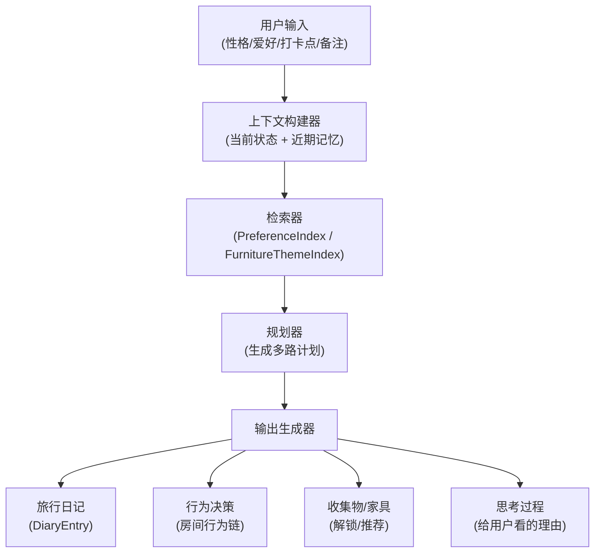

# RAG 输入/输出与“思考过程”展示规划（基于性格与旅行记忆）

> 本文基于 `PRD.md` 中的核心实体（CheckIn / DiaryEntry / CabinetItem / PetProfile 等），以及 `prototype.html` 里现有的“宠物记忆”、“性格盲盒”、“打卡”等 UI 逻辑，规划一个轻量的 RAG（检索增强生成）流程：**以“性格 + 爱好 + 打卡点”为主输入，输出多路结果（收集物、行为决策、日记、家具），并在前端直观展示 AI 的“思考过程”。**

## 1. 整体目标与范围

- **输入（来自用户与应用内）**
  - 宠物当前人格（盲盒结果），如：小火苗、小云朵、小石头等。
  - 用户显式输入的打卡点、备注文本。
  - 从历史日记/旅行记录/性格碎片中总结出的“爱好与偏好”。
  - 当前房间/橱柜中的家具与配件（已解锁的收集物）。

- **输出（模型/引擎生成）**
  - **收集物与家具**：应解锁或推荐的纪念品、小摆件、房间主题。
  - **行为决策**：房间内宠物行为链（如去床上/去小锅/去门口/原地观察）。
  - **旅行日记**：与性格相符的第一人称旅行日记（增强版 `GenerateDiary`）。
  - **“思考过程”文案**：让用户看到宠物“如何结合记忆做决定”的 2–4 步推理链路。

- **不在本轮范围**
  - 复杂的长期规划（例如完整旅行路线规划）。
  - 位置推荐、真实路径规划（仍按 MDR：MVP 手动输入地点）。

---

## 2. 数据与知识源设计

### 2.1 基础实体（来自 PRD）

直接复用 `PRD.md` 中定义的实体：

- `User`：用户基本信息。
- `PetProfile`：电子宠物档案（含当前性格 `petPersonality`）。
- `CheckIn`：打卡记录（地点、时间、备注、生成状态等）。
- `DiaryEntry`：日记条目（标题、正文、情绪标签等）。
- `CabinetItem`：橱柜配件（图片、名称、关联地点等）。

### 2.2 RAG 新增结构

在后端/本地增加一层「记忆与偏好索引」：

- **`PetMemoryEpisodic`（情景记忆）**
  - 来源：CheckIn + DiaryEntry。
  - 内容：某次旅行的简短摘要，如：
    - “2026-03-01，和主人在武汉吃热干面，觉得很有烟火气。”
  - 存储形式：
    - 原文 + 向量（embedding）。

- **`PetMemorySemantic`（语义记忆 / 性格碎片）**
  - 来源：对多条 `PetMemoryEpisodic` 的聚类与总结。
  - 内容示例：
    - “我特别喜欢海边、沙滩和海风。”  
    - “我对甜食和奶茶有明显偏好。”
  - 使用场景：供模型在做新决策时参考“长期倾向”。

- **`PreferenceIndex`（偏好索引）**
  - 将以下元素转为 embedding：
    - 常去地点类型（海边、山地、城市夜景、主题乐园等）。
    - 高频出现的食物/活动关键词（奶茶、火锅、博物馆、展览等）。
    - 用户与宠物的互动偏好（经常摸头、常用的称呼等）。
  - 提供 `top-k` 相似检索接口。

- **`FurnitureThemeIndex`（家具与场景主题）**
  - 手工/半自动维护的规则表或小向量库：
    - “海边” → 贝壳摆件、蓝色房间墙纸、海星挂件。
    - “古城/老街” → 复古木柜、油纸伞、路灯模型。
  - 输入：地点/主题关键字。
  - 输出：推荐解锁的 `CabinetItem` / 房间皮肤 ID。

---

## 3. RAG 推理流水线

### 3.1 流程图



### 3.2 上下文构建（Context Builder）

输入：

- 当前宠物人格 `currentPersonality`（如“小火苗”）。
- 当前打卡请求：
  - `currentLocation`（如“武汉”）。
  - `userNote`（若有）。
- 最近 N 条 `CheckIn` + `DiaryEntry`（例如最近 5 次）。
- 当前橱柜与房间主题概览：
  - 已解锁的 `CabinetItem`。
  - 当前房间皮肤/家具主题。

输出：

- 一个简化的“会话上下文对象”：

```json
{
  "currentPersonality": "小火苗",
  "currentLocation": "武汉",
  "recentMemories": [
    "上周在厦门海边玩了很久沙子。",
    "前几天在成都喝了很多奶茶。"
  ],
  "currentCabinetSummary": [
    "海边相关纪念品 2 个",
    "茶饮相关纪念品 1 个"
  ],
  "ownerTitle": "训练家"
}
```

### 3.3 检索器（Retriever）

基于上下文对象，执行两类检索：

1. **偏好检索（PreferenceIndex）**
   - 查询关键字组合，如：
     - `["武汉", "长江", "夜景"]`
     - `["小火苗", "活泼", "好动"]`
   - 返回与这些关键词相近的历史记忆与偏好标签。

2. **主题检索（FurnitureThemeIndex）**
   - 按地点/主题检索合适的场景/家具：
     - 例如：“江城夜景” → 推荐“夜景相框”、“江边路灯模型”。

检索结果整理为简要条目送入下一步规划器。

### 3.4 规划器（Planner）

规划器负责在一次打卡/交互中，决定以下多路输出的大致方向：

- **日记规划 `diaryPlan`**
  - 核心问题：
    - 这篇日记想强调哪段记忆？
    - 采用什么情绪/语气？
  - 例如：
    - `title`: “热干面的烟火味”
    - `moodTag`: “温暖”“烟火气”
    - `memoryAnchors`: 列表，指向 1–2 条相关历史记忆。

- **行为规划 `behaviorPlan`**
  - 输出一条行为链，供前端行为引擎执行，例如：

```json
[
  { "type": "emote", "value": "thinking", "duration": 1000 },
  { "type": "walk", "target": "pot" },
  { "type": "anim", "value": "eat", "duration": 1500 },
  { "type": "state", "value": "idle_observe" }
]
```

- **收集物与家具规划 `cabinetPlan`**
  - 决定是否在本次打卡后解锁新物件或推荐一件待解锁物件：

```json
{
  "unlockItems": [
    {
      "itemId": "wuhan_hot_dry_noodles_bowl",
      "displayName": "武汉热干面碗",
      "relatedLocation": "武汉"
    }
  ],
  "furnitureSuggestions": [
    {
      "themeId": "river_night_lights",
      "reason": "你最近经常在江边散步，我想给房间加一点夜景灯光。"
    }
  ]
}
```

- **思考过程 `thinkingSteps`**
  - 面向用户的解释型文本，通常 2–4 条：

```json
[
  "你最近带我去了很多有烟火气的地方，比如夜市和小吃街。",
  "这次来武汉吃热干面，我想把这份味道记在我们的旅行日记里。",
  "我会在橱柜里放一只热干面碗，让它替我们记住这座城市。"
]
```

### 3.5 输出生成器（Outputs）

将规划器输出分别送往不同“生成通道”：

- 日记通道：对接 `GenerateDiary` 模型，使用 `diaryPlan` 中的信息增强 Prompt。
- 行为通道：映射为前端的 `runBehaviorSequence` 行为链。
- 橱柜/家具通道：创建/更新 `CabinetItem` 和房间主题配置。
- 思考过程通道：以 UI 文案形式展示给用户。

---

## 4. 模型输入与输出字段设计

### 4.1 模型输入（扩展版 GenerateDiary）

在 `PRD.md` 第 6 章基础上，扩展输入字段：

- 已有字段：
  - `date`：当前日期。
  - `location`：打卡地点。
  - `petPersonality`：宠物性格标签。
  - `userNote`：用户备注（可选）。
  - `language`：语言。

- 新增字段：
  - `ownerTitle`：宠物对主人的称呼，如“训练家”、“伙伴”。
  - `episodicMemories`: 相关近期记忆摘要数组（2–3 条）。
  - `semanticTraits`: 长期性格/偏好标签，如“爱海边”“爱甜食”。
  - `cabinetSummary`: 橱柜中与本次地点/主题相关的物件概要。
  - `plannedMood`: 规划器给出的目标情绪标签（如“兴奋”、“温暖”）。

模型调用时的 Prompt 示例（省略细节）：

> 你是一只电子宠物玩偶，用第一人称为主人写一段旅行日记。  
> - 当前日期：{{date}}  
> - 这次打卡地点：{{location}}  
> - 我的性格：{{petPersonality}}  
> - 我平时怎么称呼主人：{{ownerTitle}}  
> - 我最近的相关记忆：{{episodicMemories}}  
> - 我的长期偏好：{{semanticTraits}}  
> - 橱柜里已有的相关小物件：{{cabinetSummary}}  
> - 本次日记整体情绪：{{plannedMood}}  
> - 字数控制在 80–200 字之间，语气可爱、治愈。

### 4.2 模型输出

建议统一格式：

```json
{
  "title": "江边的烟火味",
  "content": "……",
  "moodTag": "温暖",
  "behaviorPlan": [
    { "type": "emote", "value": "thinking", "duration": 1000 },
    { "type": "walk", "target": "pot" },
    { "type": "anim", "value": "eat", "duration": 1500 },
    { "type": "state", "value": "idle_observe" }
  ],
  "cabinetPlan": {
    "unlockItems": [
      {
        "itemId": "wuhan_hot_dry_noodles_bowl",
        "displayName": "武汉热干面碗",
        "relatedLocation": "武汉"
      }
    ],
    "furnitureSuggestions": []
  },
  "thinkingSteps": [
    "你最近带我去了很多有烟火气的地方，比如夜市和小吃街。",
    "这次来武汉吃热干面，我想把这份味道记在我们的旅行日记里。",
    "我会在橱柜里放一只热干面碗，让它替我们记住这座城市。"
  ]
}
```

- `title` / `content` / `moodTag`：直接写入 `DiaryEntry`。
- `behaviorPlan` / `cabinetPlan` / `thinkingSteps`：作为扩展字段，仅前端与行为引擎使用。

---

## 5. “思考过程” UI 展示方案

### 5.1 使用的 UI 元素

基于现有 `prototype.html`：

- 顶部状态栏：`#pet-status-bar`。
- 底部固定对话栏：`#pet-dialog-bar` + `#pet-dialog-text`。
- 房间内跟随气泡：`#pet-action-bubble`（目前默认隐藏，可重启用作“脑内 OS”）。

### 5.2 三阶段展示节奏

触发条件分为两类：

- **打卡触发**：用户完成一次新的打卡提交（写入 `CheckIn`）；
- **自动行为触发**：宠物在房间内由行为引擎（如 `applyBehaviorDecision`）做出一条“主动”行为决策时（例如：自己决定去窗边发呆、去床上趴着、去锅边闻一闻）。

1. **准备阶段（检索中）**
   - 时长：约 0.5–1.0 秒。
   - UI：
     - 顶部状态栏：显示“我在翻我们的旅行记忆……”或类似轻量文案。
     - 底部对话栏：淡入“稍等一下，我想想我们最近去了哪里～”等提示。
   - 技术上，此阶段开始异步调用 RAG 检索与模型。

2. **思考阶段（理由展示）**
   - 时长：依据 `thinkingSteps` 数量分 2–3 步展示。
   - UI：
     - 使用底部对话栏逐条展示 `thinkingSteps`，每条 1.5–2.0s。
     - 也可以在房间内启用 `#pet-action-bubble` 作为“脑内泡泡”，显示简短版理由。
   - 行为：
     - 行为计划尚未执行，仅显示“头脑风暴”过程。

3. **输出阶段（结果落地）**
   - 行为执行：
     - 调用前端 `runBehaviorSequence(behaviorPlan)`，驱动宠物在房间内走到锅边/床边/门口等。
   - UI 更新：
     - 若来自打卡触发：
       - 橱柜中新增推荐/解锁的物件卡片（若有）。
       - 日记 Tab 中追加最新 `DiaryEntry`。
       - 底部对话栏：例如“整理好了！这次我就这么记下来啦～”。
     - 若来自自动行为触发：
       - 仅在房间内执行对应行为链，不强制写入日记或解锁新物件；
       - 底部对话栏和/或 `#pet-action-bubble` 展示一两句简短的 `thinkingSteps`，解释“它为什么突然这么做”（例如“我想靠近窗边看看今天的天气～”）。

### 5.3 失败与降级策略

- 若 RAG 检索或模型调用失败：
  - 使用模板日记（参考 `PRD.md` 第 6 章降级策略）。
  - 行为计划退化为简单固定行为（如轻微跳跃+观察）。
  - “思考过程”简化为一条模板文案：
    - “网络今天有点小问题，不过我还是会记住这次旅行的！”

### 5.4 用户界面布局与绑定

从“玩家看到什么”的角度，把上面的思考链路落在具体界面元素上，便于前端实现与联调。

#### 5.4.1 打卡时的默认展示（不增加额外按钮）

- 触发方式：
  - 沿用现有“打卡确认/提交”动作作为唯一触发点，不新增额外按钮。
  - 每次成功打卡并写入 `CheckIn` 后，自动进入本节所述的“思考过程展示”流程。

- 房间视图与对话栏：
  - 房间视图区域继续作为宠物和家具的主舞台，无需新增入口。
  - 顶部 `#pet-status-bar` 与底部 `#pet-dialog-bar` / `#pet-dialog-text` 复用现有布局：
    - “准备阶段”“思考阶段”“输出阶段”的文案都走底部对话栏。
    - 若需要在房间内更明显地表达“在想事情”，可以按需启用已有的 `#pet-action-bubble`，但不额外增加点击控件。

- 日记浏览：
  - 仍沿用当前的“日记列表 + 详情”入口（例如已有的日记 Tab 或按钮），不专门为“思考过程”新增入口。
  - 当某条 `DiaryEntry` 具备 `thinkingSteps` 时，在该条详情里以静态文本展示（比如在正文下方增加一个简短说明区），玩家只读不交互。

#### 5.4.2 思考过程与控件的对应关系

- `thinkingSteps`
  - 展示优先级：
    1. 底部 `#pet-dialog-bar`：
       - 对于“打卡触发”的决策：每次打卡后自动按顺序展示 2–3 句完整理由文案，无需玩家点击；
       - 对于“自动行为触发”的决策：在行为执行前后插入 1–2 句更短的理由，解释当下这条行为。
    2. `#pet-action-bubble`：如果开启，则显示当前步骤的短句版或前半句，营造“在自言自语”的感觉，适用于打卡和自动行为两种场景。
  - 交互细节：
    - 保持“被动观看”体验，不增加额外按钮；
    - 若需要跳过，可复用现有“切换页面/收起对话栏”等操作作为自然打断，无需专门的“跳过思考”控件。

- `behaviorPlan`
  - 与动画系统的接口：
    - 每个 `behaviorPlan` 步骤映射到一个前端动画/行为命令（move / anim / wait / state）。
    - 界面无需暴露底层指令，只需在房间视图中可视化表现宠物行为。
  - UI 反馈：
    - 正在执行行为链时，底部对话栏可以显示当前行为对应的一句话说明：
      - 例如：“我要去小锅边想一想今天吃了什么～”

- `cabinetPlan`
  - 橱柜入口：
    - 房间视图中的橱柜区域增加“小红点/闪光”提示，表示有新解锁物件。
  - 橱柜列表 UI：
    - 新解锁的 `unlockItems` 在列表顶部或对应分类中以“NEW”角标高亮。
    - 若有 `furnitureSuggestions` 但尚未正式解锁，可以以“推荐”卡片的形式展示：
      - 卡片文案使用 `reason` 字段，例如：“你最近经常在江边散步，我想给房间加一点夜景灯光。”

#### 5.4.3 空态与历史回看

- 空态（尚无任何 `DiaryEntry` / 打卡记录）：
  - 房间页：
    - 底部对话栏使用引导文案，如“带我去第一个地方看看吧～”。
  - 打卡页：
    - 在按钮下方提醒“第一次打卡我会记得特别清楚！”。

- 历史回看：
  - 在日记详情页中，若该条日记生成时曾有 `thinkingSteps`：
    - 直接以静态文本形式附在正文下方，用于事后回看；
    - 不强制提供“重播行为”或“跳转橱柜”按钮，避免打断现有交互流。

---

## 6. 与现有代码的衔接点

### 6.1 行为引擎

在已有规划 `spec.md` 与 `tasks.md` 中，行为相关关键点：

- `runBehaviorSequence(sequence)`：执行行为链（move / anim / wait / state 等）。
- `applyBehaviorDecision`：根据决策结果选择不同行为序列（去床、去锅、去门、原地观察等）。

对接方式：

- 当模型输出中包含 `behaviorPlan` 时：
  - 直接将其传给 `runBehaviorSequence`；
  - 或在 `applyBehaviorDecision` 内，将来自模型的 `behaviorPlan` 作为高优先级路径。

### 6.2 日记生成

- 已有 `GenerateDiary` 接口定义。
- 更新点：
  - 在触发日记生成时，由 RAG 流程先构建 `diaryPlan` 和增强版输入字段，再调用模型；
  - 将模型返回的 `behaviorPlan`、`cabinetPlan`、`thinkingSteps` 存入扩展字段中，前端消费。

### 6.3 橱柜与家具

- 在创建/更新 `CabinetItem` 前：
  - 检查 `cabinetPlan.unlockItems` 与 `furnitureSuggestions`；
  - 对应地新增/标记橱柜物件与房间主题。

---

## 7. 示例：从输入到多路输出

### 7.1 示例输入

- 当前人格：小火苗（活泼、爱闹腾）。
- 当前打卡地点：武汉。
- 最近记忆：
  - “上周在长沙夜市吃了很多小吃。”
  - “前几天在成都喝了好几杯奶茶。”
- 橱柜中已有：
  - 奶茶杯纪念品 1 个。
  - 夜市灯牌 1 个。

### 7.2 RAG 检索结果（简化）

- 偏好：
  - “喜欢有烟火气的夜市和小吃。”
  - “对甜食饮料有偏好。”
- 家具推荐：
  - 与“热干面”“小吃街”相关的纪念碗/灯牌。

### 7.3 规划器输出（摘要）

- `diaryPlan`：
  - 标题：“江城的烟火味”。
  - 情绪：温暖、热闹。
  - 记忆锚点：长沙夜市、成都奶茶。
- `behaviorPlan`：
  - 思考 → 走到小锅 → 做吃东西动作 → 回到原地观察。
- `cabinetPlan`：
  - 解锁“热干面碗”摆件，放在橱柜第二排中间。
- `thinkingSteps`：
  - “你最近总带我去有很多小吃的地方。”
  - “这次的热干面也很有烟火气，我要好好记住它。”
  - “我会在橱柜里放一只热干面碗来纪念今天。”

### 7.4 模型与前端落地

- 模型：
  - 生成一篇带有“小火苗”语气的武汉日记，引用长沙/成都的经历做对比。
- 前端：
  - 在宠物房中演示「思考 → 走向小锅 → 吃 → 观察」动画；
  - 在橱柜中新增“热干面碗”卡片；
  - 在日记 Tab 中新增一条武汉日记；
  - 在底部对话栏中按顺序展示 `thinkingSteps`，最后总结一句。

---

## 8. 实施建议

1. **第一阶段：无模型、本地规则 RAG**
   - 先用简单规则和本地数据结构模拟 `PreferenceIndex` 与 `FurnitureThemeIndex`。
   - `thinkingSteps` 与 `behaviorPlan` 可由规则模板生成。

2. **第二阶段：接入向量检索与模型**
   - 将 `PetMemoryEpisodic` / `PetMemorySemantic` 存入向量库；
   - 接入实际的文本生成模型（沿用 `gemini-3.0-flash`）；
   - 让模型产出 `behaviorPlan` / `cabinetPlan` / `thinkingSteps`。

3. **第三阶段：优化提示与可视化**
   - 根据埋点数据调优 Prompt 与展示节奏；
   - 增加更多风格化“思考过程”动效（例如光点在房间不同物件间跳跃）。

通过以上设计，可以在不大改现有 UI/逻辑的前提下，引入一个以“性格 + 记忆 + 打卡点”为核心的 RAG 决策层，让宠物的行为和日记从“看起来有点随机”升级为“有理有据的陪伴感”。 

